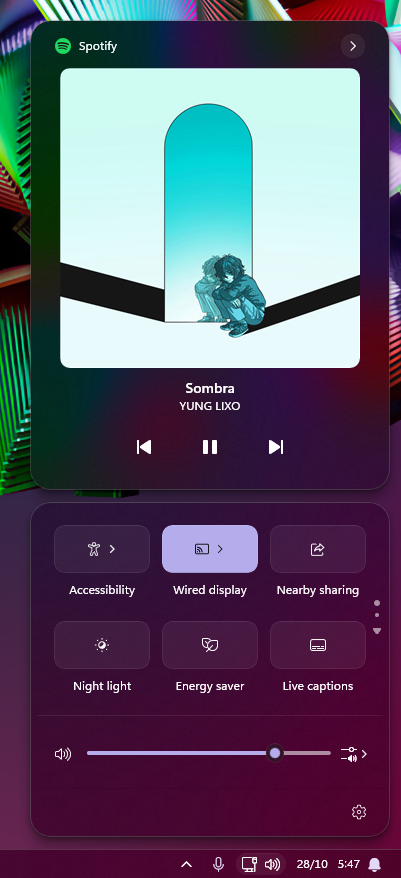

# Luminosity theme for Windows 11 Notification Center Styler

**Author**: [mendes.image](https://github.com/mendesimage)


## Intro
**Luminosity** is based on native Acrylic, using the maximum **TintLuminosityOpacity** value as its backdrop.

It's meant to be used with **Mica** or **MicaAlt** backdrops, with or without the **Translucent Windows** mod.

---



---

## General Information

The theme changes the following elements:

- Control and Notification Center
- Notification Pop-Up
- App Group Backdrops
- Rounded several buttons
- Jump Lists
- Context menus

---

## Full Luminosity Theme

For that, download the listed mods and select "**Luminosity**" on each.
- Windows 11 Taskbar Styler
- Windows 11 Start Menu Styler
- Windows 11 Notification Center Styler
- Windows 11 File Explorer Styler

I also highly recommend **Translucent Windows** with **Mica** or **MicaAlt** selected as backdrop.

---

## Theme selection

The theme is integrated into the mod and can simply be selected from the mod's
settings:

* Open the Windows 11 Taskbar Styler mod in Windhawk.
* Go to the "Settings" tab.
* Select the theme and save the settings.

## Manual installation

The theme styles can also be imported manually. To do that, follow these steps:

* Open the Windows 11 Taskbar Styler mod in Windhawk.
* Go to the "Advanced" tab.
* Copy the content below to the text box under "Mod settings" and click "Save".

<details>
<summary>Content to import (click to expand)</summary>

```json
{ 
  "controlStyles[0].target": "Grid#NotificationCenterGrid",
  "controlStyles[0].styles[0]": "Background:=$mbg",
  "controlStyles[0].styles[1]": "CornerRadius=$wcr",
  "controlStyles[0].styles[2]": "BorderThickness=$bt",
  "controlStyles[0].styles[3]": "BorderBrush=$bb",
  "controlStyles[0].styles[4]": "Shadow:=",

  "controlStyles[1].target": "Grid#NotificationCenterTopBanner",
  "controlStyles[1].styles[0]": "CornerRadius=$wcr",
  "controlStyles[1].styles[1]": "Margin=5,6,5,0",

  "controlStyles[2].target": "Windows.UI.Xaml.Controls.Grid#RootGrid > Windows.UI.Xaml.Controls.ContentPresenter#ContentPresenter",
  "controlStyles[2].styles[0]": "CornerRadius=18",
  "controlStyles[2].styles[1]": "Margin=0,0,0,0",

  "controlStyles[3].target": "Windows.UI.Xaml.Controls.Grid > Windows.UI.Xaml.Controls.Border#ItemOpaquePlating",
  "controlStyles[3].styles[0]": "CornerRadius=$mcr",
  "controlStyles[3].styles[1]": "BorderBrush:=$t",
  "controlStyles[3].styles[2]": "Shadow:=",  

  "controlStyles[4].target": "Grid#CalendarCenterGrid",
  "controlStyles[4].styles[0]": "Background:=$mbg",
  "controlStyles[4].styles[1]": "CornerRadius=$wcr",
  "controlStyles[4].styles[2]": "Shadow:=",

  "controlStyles[5].target": "ScrollViewer#CalendarControlScrollViewer",
  "controlStyles[5].styles[0]": "Background:=$t",
  "controlStyles[5].styles[1]": "BorderBrush:=$t",

  "controlStyles[6].target": "Border#CalendarHeaderMinimizedOverlay",
  "controlStyles[6].styles[0]": "Background:=$t",

  "controlStyles[7].target": "ActionCenter.FocusSessionControl#FocusSessionControl > Grid#FocusGrid",
  "controlStyles[7].styles[0]": "Background:=$t",
  "controlStyles[7].styles[1]": "BorderBrush:=$t",

  "controlStyles[8].target": "Windows.UI.Xaml.Controls.Grid#ControlCenterRegion",
  "controlStyles[8].styles[0]": "Background:=$mbg",
  "controlStyles[8].styles[1]": "CornerRadius=$wcr",
  "controlStyles[8].styles[2]": "Shadow:=",

  "controlStyles[9].target": "ScrollViewer#ListContent",
  "controlStyles[9].styles[0]": "Background:=$t",
  "controlStyles[9].styles[1]": "BorderBrush:=$t",

  "controlStyles[10].target": "Windows.UI.Xaml.Controls.Grid#L1Grid > Border",
  "controlStyles[10].styles[0]": "Background:=$t",
  "controlStyles[10].styles[1]": "BorderBrush:=$t",

  "controlStyles[11].target": "Windows.UI.Xaml.Controls.ContentPresenter",
  "controlStyles[11].styles[0]": "CornerRadius=$bcr",

  "controlStyles[12].target": "Windows.UI.Xaml.Controls.Primitives.Thumb#HorizontalThumb > Windows.UI.Xaml.Controls.Border",
  "controlStyles[12].styles[0]": "Background:= <AcrylicBrush TintColor=\"{ThemeResource CardStrokeColorDefaultSolid}\" FallbackColor=\"{ThemeResource CardStrokeColorDefaultSolid}\" TintOpacity=\"0.5\" TintLuminosityOpacity=\"1.0\" Opacity=\"1\"/>",


  "controlStyles[13].target": "Grid#MediaTransportControlsRegion",
  "controlStyles[13].styles[0]": "Background:=$mbg",
  "controlStyles[13].styles[1]": "CornerRadius=$wcr",
  "controlStyles[13].styles[2]": "Height=470",  
  "controlStyles[13].styles[3]": "Shadow:=",


  "controlStyles[14].target": "Windows.UI.Xaml.Controls.Grid#MediaTransportControlsRegion",
  "controlStyles[14].styles[0]": "Height=470",

  "controlStyles[15].target": "Windows.UI.Xaml.Controls.Grid#AlbumTextAndArtContainer",
  "controlStyles[15].styles[0]": "Height=347",

  "controlStyles[16].target": "Windows.UI.Xaml.Controls.Grid#ThumbnailImage",
  "controlStyles[16].styles[0]": "Width=300",
  "controlStyles[16].styles[1]": "Height=300",
  "controlStyles[16].styles[2]": "HorizontalAlignment=Center",
  "controlStyles[16].styles[3]": "VerticalAlignment=Top",
  "controlStyles[16].styles[4]": "Grid.Column=1",
  "controlStyles[16].styles[5]": "Margin=0,2,0,0",

  "controlStyles[17].target": "Windows.UI.Xaml.Controls.Grid#ThumbnailImage > Windows.UI.Xaml.Controls.Border",
  "controlStyles[17].styles[0]": "CornerRadius=10",

  "controlStyles[18].target": "Windows.UI.Xaml.Controls.StackPanel#PrimaryAndSecondaryTextContainer",
  "controlStyles[18].styles[0]": "VerticalAlignment=Bottom",
  "controlStyles[18].styles[1]": "Grid.Column=0",

  "controlStyles[19].target": "Windows.UI.Xaml.Controls.StackPanel#PrimaryAndSecondaryTextContainer > Windows.UI.Xaml.Controls.TextBlock#TitleText",
  "controlStyles[19].styles[0]": "TextAlignment=Center",

  "controlStyles[20].target": "Windows.UI.Xaml.Controls.StackPanel#PrimaryAndSecondaryTextContainer > Windows.UI.Xaml.Controls.TextBlock#SubtitleText",
  "controlStyles[20].styles[0]": "TextAlignment=Center",

  "controlStyles[21].target": "Grid#MediaTransportControlsRoot",
  "controlStyles[21].styles[0]": "Background:=<SolidColorBrush Color=\"Transparent\"/>",

  "controlStyles[22].target": "MenuFlyoutPresenter",
  "controlStyles[22].styles[0]": "CornerRadius:=$mcr",
  "controlStyles[22].styles[1]": "BorderThickness:=$bt",
  "controlStyles[22].styles[2]": "BorderBrush:=$bb",
  "controlStyles[22].styles[3]": "Shadow:=",

  "controlStyles[23].target": "Border#JumpListRestyledAcrylic",
  "controlStyles[23].styles[0]": "Background:=$mbg",
  "controlStyles[23].styles[1]": "CornerRadius:=$mcr",
  "controlStyles[23].styles[2]": "BorderThickness=$bt",
  "controlStyles[23].styles[3]": "BorderBrush=$bb",
  "controlStyles[23].styles[4]": "Shadow:=",

  "controlStyles[24].target": "Border#ToastBackgroundBorder2",
  "controlStyles[24].styles[0]": "Background:=$mbg",
  "controlStyles[24].styles[1]": "CornerRadius=$wcr",
  "controlStyles[24].styles[2]": "Shadow:=",

  "controlStyles[25].target": "Windows.UI.Xaml.Controls.ToolTip > Windows.UI.Xaml.Controls.ContentPresenter#LayoutRoot",
  "controlStyles[25].styles[0]": "Background:=$mbg",
  "controlStyles[25].styles[1]": "CornerRadius=13",
  "controlStyles[25].styles[2]": "BorderThickness=$bt",
  "controlStyles[25].styles[3]": "BorderBrush=$bb",
  "controlStyles[25].styles[4]": "Shadow:=",

  "controlStyles[26].target": "Windows.UI.Xaml.Controls.Grid#FooterGrid",
  "controlStyles[26].styles[0]": "BorderBrush:=$t",

  "controlStyles[27].target": "ActionCenter.MultiLineTextBox#Edit",
  "controlStyles[27].styles[0]": "CornerRadius=$bcr",

  "controlStyles[28].target": "Windows.UI.Xaml.Controls.MenuFlyoutItem",
  "controlStyles[28].styles[0]": "CornerRadius=$bcr",

  "controlStyles[29].target": "Windows.UI.Xaml.Controls.MenuFlyoutSubItem",
  "controlStyles[29].styles[0]": "CornerRadius=$bcr",

  "controlStyles[30].target": "Windows.UI.Xaml.Controls.ListViewItem",
  "controlStyles[30].styles[0]": "CornerRadius=$bcr",

  "controlStyles[31].target": "Windows.UI.Xaml.Controls.ContentPresenter#PageHeader",
  "controlStyles[31].styles[0]": "Background:=$t",

  "controlStyles[32].target": "Windows.UI.Xaml.Controls.ContentPresenter > Windows.UI.Xaml.Controls.Border",
  "controlStyles[32].styles[0]": "BorderBrush:=$t",

  "controlStyles[33].target": "Windows.UI.Xaml.Controls.Primitives.ListViewItemPresenter#Root > Border",
  "controlStyles[33].styles[0]": "CornerRadius=$bcr",

  "controlStyles[34].target": "Windows.UI.Xaml.Controls.Primitives.RepeatButton#PreviousButton > Windows.UI.Xaml.Controls.ContentPresenter#ContentPresenter@CommonStates",
  "controlStyles[34].styles[0]": "Background@Normal:=$mbt",
  "controlStyles[34].styles[1]": "Background@PointerOver:=$mbth",
  "controlStyles[34].styles[2]": "Background@Pressed:=$mbtp",
  "controlStyles[34].styles[3]": "RenderTransform:=<TranslateTransform X=\"15\" Y=\"0\" />",
  "controlStyles[34].styles[4]": "BorderBrush=$bbb",
  "controlStyles[34].styles[5]": "BorderThickness@Normal=$bt",
  "controlStyles[34].styles[6]": "BorderThickness@PointerOver=$bt",
  "controlStyles[34].styles[7]": "BorderThickness@Pressed=$bt",

  "controlStyles[35].target": "Windows.UI.Xaml.Controls.Button#PlayPauseButton > Windows.UI.Xaml.Controls.ContentPresenter#ContentPresenter@CommonStates",
  "controlStyles[35].styles[0]": "Background@Normal:=$mbt",
  "controlStyles[35].styles[1]": "Background@PointerOver:=$mbth",
  "controlStyles[35].styles[2]": "Background@Pressed:=$mbtp",
  "controlStyles[35].styles[3]": "Width=110",
  "controlStyles[35].styles[4]": "BorderBrush=$bbb",
  "controlStyles[35].styles[5]": "BorderThickness@Normal=$bt",
  "controlStyles[35].styles[6]": "BorderThickness@PointerOver=$bt",
  "controlStyles[35].styles[7]": "BorderThickness@Pressed=$bt",

  "controlStyles[36].target": "Windows.UI.Xaml.Controls.Primitives.RepeatButton#NextButton > Windows.UI.Xaml.Controls.ContentPresenter#ContentPresenter@CommonStates",
  "controlStyles[36].styles[0]": "Background@Normal:=$mbt",
  "controlStyles[36].styles[1]": "Background@PointerOver:=$mbth",
  "controlStyles[36].styles[2]": "Background@Pressed:=$mbtp",
  "controlStyles[36].styles[3]": "RenderTransform:=<TranslateTransform X=\"-15\" Y=\"0\" />",
  "controlStyles[36].styles[4]": "BorderBrush=$bbb",
  "controlStyles[36].styles[5]": "BorderThickness@Normal=$bt",
  "controlStyles[36].styles[6]": "BorderThickness@PointerOver=$bt",
  "controlStyles[36].styles[7]": "BorderThickness@Pressed=$bt",
  
  "controlStyles[37].target": "Windows.UI.Xaml.Shapes.Rectangle#HorizontalTrackRect",
  "controlStyles[37].styles[0]": "Fill:=$bbb",

  "controlStyles[38].target": "MenuFlyoutPresenter > Border",
  "controlStyles[38].styles[0]": "Background:=$mbg",

  "controlStyles[39].target": "ScrollViewer#MenuFlyoutPresenterScrollViewer > Border > Grid > ScrollContentPresenter > ItemsPresenter > StackPanel",
  "controlStyles[39].styles[0]": "ChildrenTransitions:=<TransitionCollection><EntranceThemeTransition IsStaggeringEnabled=\"True\" FromHorizontalOffset=\"0\" FromVerticalOffset=\"100\" /></TransitionCollection>",
  "controlStyles[40].target": "Windows.UI.Xaml..Controls.Grid#JumpListGrid > Windows.UI.Xaml.Controls.Grid#SystemItemsContainer > Windows.UI.Xaml.Controls.Border > JumpViewUI.SystemItemListView#SystemItemList > Windows.UI.Xaml.Controls.StackPanel",
  "controlStyles[40].styles[0]": "ChildrenTransitions:=<TransitionCollection><EntranceThemeTransition IsStaggeringEnabled=\"True\" FromHorizontalOffset=\"0\" FromVerticalOffset=\"100\" /></TransitionCollection>",
  "controlStyles[41].target": "Grid#LayoutRoot",
  " controlStyles[41].styles[0]": "BackgroundTransition:=<BrushTransition Duration=\"0:0:0.100\" />",
  "controlStyles[42].target": "Border#BackgroundBorder",
  "controlStyles[42].styles[0]": "BackgroundTransition:=<BrushTransition Duration=\"0:0:0.100\" />",


  "styleConstants[0]": "mbg=<AcrylicBrush TintColor=\"{ThemeResource CardStrokeColorDefaultSolid}\" FallbackColor=\"{ThemeResource CardStrokeColorDefaultSolid}\" TintOpacity=\"0.0\" TintLuminosityOpacity=\"1.0\" Opacity=\"1\"/>",
  "styleConstants[1]": "bcr=10",
  "styleConstants[2]": "bbb=#13FFFFFF",
  "styleConstants[3]": "wcr=20",
  "styleConstants[4]": "mcr=15",
  "styleConstants[5]": "t=Transparent",
  "styleConstants[6]": "bb=#20FFFFFF",
  "styleConstants[7]": "bt=1",
  "styleConstants[8]": "mbt=#10FFFFFF",
  "styleConstants[9]": "mbth=#15FFFFFF",
  "styleConstants[10]": "mbtp=#15FFFFFF"
}
```
</details>