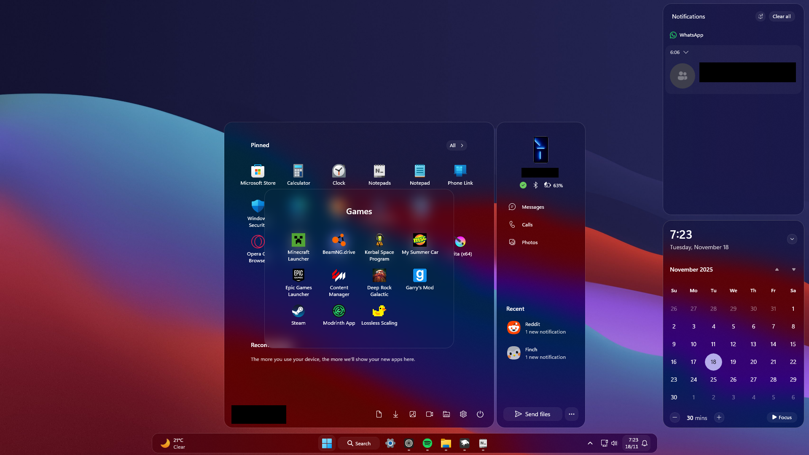
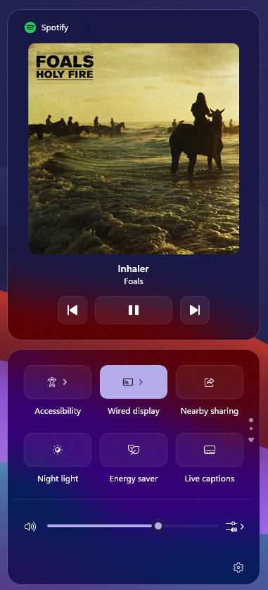

## Luminosity Windows 11 Theme Pack (Beta)
Early access to the Luminosity updates. They may contain issues and messy code. Luminosity is a theme pack for Windhawk's Windows 11 Styler mods.

# ⚠️ Beta Warning
**This is a Beta release.**
While the themes have been tested, they are not final. Expect issues, unfinished features, and visual inconsistencies. Feedback is appreciated!

Theme JSON is up to date, but README information likely isn't!

## Installation Guide

Content to Install (click to expand)

To apply the theme, you will need:
- [Windhawk](https://windhawk.net/) (Of course)

### Requeired Windhawk Mods
**Taskbar**
- [Windows 11 Taskbar Styler](https://windhawk.net/mods/windows-11-taskbar-styler)
  **Required for Compact Taskbar**
  - [Taskbar Labels for Windows 11](https://windhawk.net/mods/taskbar-labels)
  - [Taskbar Clock Customization](https://windhawk.net/mods/taskbar-clock-customization)

**Start Menu**
- [Windows 11 Start Menu Styler](https://windhawk.net/mods/windows-11-start-menu-styler)

**Notification / Action Center**
- [Windows 11 Notification Center Styler](https://windhawk.net/mods/windows-11-notification-center-styler)

**File Explerer**
- [Windows 11 File Explorer Styler](https://windhawk.net/mods/windows-11-file-explorer-styler)

**Recommended**
[Translucent Windows](https://windhawk.net/mods/translucent-windows) (use Mica or MicaAlt)

---

# Introduction

**Luminosity** is based on Windows's native Acrylic, using the maximum `TintLuminosityOpacity` value as its backdrop and more rounded UI elements.

It's meant to work well on dark windows, with **Mica** or **MicaAlt** backdrops, with or without the **Translucent Windows** mod.

---

## Theme Status
| Component                         | Version   | Status              | Notes                            |
| --------------------------------- | --------- | ------------------- | -------------------------------- |
| **Taskbar**                       | **1.0.1** | 🔍 Under Testing   | N/A |
| **Start Menu**                    | **0.1.0** | 🔧 Work in Progress | Messy code, missing screenshots  |
| **Notification / Control Center** | **0.1.0** | 🔧 Work in Progress | Messy code, missing styles       |
| **File Explorer**                 | **0.1.0** | ⚠️ Heavy WIP        | Messy code, multiple issues      |

---

# 📜 Changelog

(Click to expand)

*All notable changes to this project will be documented in this file.*

This changelog follows **[Keep a Changelog](https://keepachangelog.com/en/1.0.0/)** and uses **Semantic Versioning**.

---

# Planned

### Taskbar
- Nothing, for now.

### Start Menu
- Attempt to add more customization to Start Menu's App list and Search Menu.

### Notification / Action Center
- Attempt to add missing JumpLists menu animations, and maybe remove more separation borders in other areas of the Action Center (Wired Display & Project).

### File Explorer
- Attempt to remove drop shadows and add matching corner radius and borders to more XAML elements.
	- I believe I can't add the Luminosity backdrop.

---

# Theme-Specific Versions

## **Taskbar**

### **[0.10.0] – Current**

**Status:** Under Testing

**Added**

- Added styles to Virtual Desktop hover flyout

**Fixed**

- Uncentralized text

---

## **Start Menu**

### **[0.1.0] – Current**

**Status:** Work in Progress

**Added**

- Moved the main grid up to remove Search Box and typing UI. Only hiding the Search UI elements still keeps the text navigation beam.
- Moved the Recommendation section down.
- Moved the lower icons for overall consistency with the Right Companion (Phone Link).
- Hovering and Menu animations.

**Known Issues**

* Visual issues in lower screen resolutions.
* Messy code.
* Missing screenshots.
* Some UI elements not themed yet

---

## **Notification / Control Center**

### **[0.1.0] – Current**

**Status:** Work in Progress

**Added**

* Hovering an Menu animations

**Known Issues**

* Visual issues in lower screen resolutions.
* Messy code.
* Some UI elements not themed yet.

---

## **File Explorer**

### **[0.1.0] – Current**

**Status:** Heavy Work in Progress

**Added**

* Many styles.

**Known Issues**

* Multiple visual issues.
* Messy code.

---

# Older Versions

## **Taskbar**

### **[0.9.0]**

**Status:** Stable

**Added**

- Custom hovering and Menu animations thanks to [SandTechStuff's Fluid Start Menu theme](https://github.com/ramensoftware/windows-11-start-menu-styling-guide/tree/main/Themes/Fluid).

**Fixed**

- Animation speeds.
