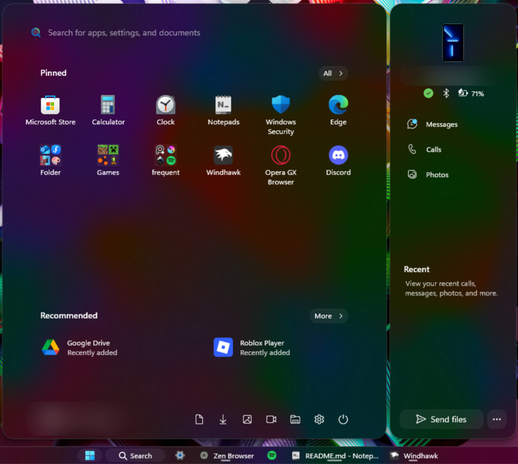

# Luminosity theme for Windows 11 Start Menu Styler

**Author**: [mendes.image](https://github.com/mendesimage)



> [!IMPORTANT]
> It can have __**issues**__ with the [redesigned Windows 11 Start menu](https://microsoft.design/articles/start-fresh-redesigning-windows-start-menu/)! 
> I currently don't have access to the 25h2 update.

## Intro
**Luminosity** is based on native Acrylic, using the maximum **TintLuminosityOpacity** value as its backdrop.

It's meant to be used with **Mica** or **MicaAlt** backdrops, with or without the **Translucent Windows** mod.

---

## Optional: Clear Acrylic App Group Background

If you prefer a Clear Acrylic look for the App Groups background instead of the default blur, you can change one value in the configuration file:

Find this line in the end:
```
"controlStyles[19].styles[3]": "Background:=$1"
```

Replace the **"Background"** value from ```$1``` to ```$2```, like this:
```
"controlStyles[19].styles[3]": "Background:=$2"
```
---

## General Information

The theme changes the following elements:

- Start and Search Menu
- App Group Backdrops
- Rounded several buttons
- Context menus

---

## Full Luminosity Theme

For that, download the listed mods and select "**Luminosity**" on each.
- Windows 11 Taskbar Styler
- Windows 11 Start Menu Styler
- Windows 11 Notification Center Styler
- Windows 11 File Explorer Styler

I also highly recommend **Translucent Windows** with **Mica** or **MicaAlt** selected as backdrop.

---

## Theme selection

The theme is integrated into the mod and can simply be selected from the mod's
settings:

* Open the Windows 11 Taskbar Styler mod in Windhawk.
* Go to the "Settings" tab.
* Select the theme and save the settings.

## Manual installation

The theme styles can also be imported manually. To do that, follow these steps:

* Open the Windows 11 Taskbar Styler mod in Windhawk.
* Go to the "Advanced" tab.
* Copy the content below to the text box under "Mod settings" and click "Save".

<details>
<summary>Content to import (click to expand)</summary>

```json
{
  "controlStyles[0].target": "Border#AcrylicBorder",
  "controlStyles[0].styles[0]": "Background:=$mbg",
  "controlStyles[0].styles[1]": "CornerRadius=$wcr",
  "controlStyles[0].styles[2]": "BorderThickness=$bt",
  "controlStyles[0].styles[3]": "BorderBrush=$bb",

  "controlStyles[1].target": "Windows.UI.Xaml.Controls.Border#DropShadowDismissTarget",
  "controlStyles[1].styles[0]": "CornerRadius=$wcr",
  "controlStyles[1].styles[1]": "Visibility=1",

  "controlStyles[2].target": "Windows.UI.Xaml.Controls.Border#RootGridDropShadow",
  "controlStyles[2].styles[0]": "CornerRadius=$wcr",
  "controlStyles[2].styles[1]": "Visibility=1",

  "controlStyles[3].target": "Windows.UI.Xaml.Controls.Border#RightCompanionDropShadow",
  "controlStyles[3].styles[0]": "CornerRadius=$wcr",
  "controlStyles[3].styles[1]": "Visibility=1",

  "controlStyles[4].target": "Windows.UI.Xaml.Controls.Border#AcrylicOverlay",
  "controlStyles[4].styles[0]": "Visibility=Collapsed",

  "controlStyles[5].target": "Windows.UI.Xaml.Controls.Border#BorderElement",
  "controlStyles[5].styles[0]": "Visibility=Collapsed",

  "controlStyles[6].target": "Button#ShowAllAppsButton",
  "controlStyles[6].styles[0]": "CornerRadius=$bcr",

  "controlStyles[7].target": "Button#CloseAllAppsButton",
  "controlStyles[7].styles[0]": "CornerRadius=$bcr",

  "controlStyles[8].target": "Windows.UI.Xaml.Controls.ContentPresenter#ContentPresenter",
  "controlStyles[8].styles[0]": "CornerRadius=$bcr",

  "controlStyles[9].target": "Windows.UI.Xaml.Controls.Border#BorderBackground",
  "controlStyles[9].styles[0]": "CornerRadius=$bcr",

  "controlStyles[10].target": "Windows.UI.Xaml.Controls.Border#BackgroundBorder",
  "controlStyles[10].styles[0]": "Cornerradius:=$bcr",

  "controlStyles[11].target": "Border#ContentBorder",
  "controlStyles[11].styles[0]": "CornerRadius=6",

  "controlStyles[12].target": "Border#AppBorder",
  "controlStyles[12].styles[0]": "Background:=$mbg",
  "controlStyles[12].styles[1]": "CornerRadius=$wcr",

  "controlStyles[13].target": "Windows.UI.Xaml.Controls.Border#BackgroundBorder",
  "controlStyles[13].styles[0]": "CornerRadius:=$wcr",

  "controlStyles[14].target": "Windows.UI.Xaml.Controls.Border#AppBorder",
  "controlStyles[14].styles[0]": "CornerRadius:=$wcr",
  "controlStyles[14].styles[1]": "BorderThickness=$bt",
  "controlStyles[14].styles[2]": "BorderBrush=$bb",

  "controlStyles[15].target": "Windows.UI.Xaml.Controls.Border#LayerBorder",
  "controlStyles[15].styles[0]": "Visibility=1",

  "controlStyles[16].target": "Border#dropshadow",
  "controlStyles[16].styles[0]": "CornerRadius:=$wcr",
  "controlStyles[16].styles[1]": "Visibility=1",

  "controlStyles[17].target": "Windows.UI.Xaml.Controls.MenuFlyoutPresenter > Windows.UI.Xaml.Controls.Border",
  "controlStyles[17].styles[0]": "Background:=$mbg",
  "controlStyles[17].styles[1]": "CornerRadius=$mcr",
  "controlStyles[17].styles[2]": "BorderThickness=$bt",
  "controlStyles[17].styles[3]": "BorderBrush=$bb",

  "controlStyles[18].target": "Windows.UI.Xaml.Controls.ToolTip > Windows.UI.Xaml.Controls.ContentPresenter#LayoutRoot",
  "controlStyles[18].styles[0]": "Background:=$mbg",
  "controlStyles[18].styles[1]": "CornerRadius=$mcr",
  "controlStyles[18].styles[2]": "BorderThickness=$bt",
  "controlStyles[18].styles[3]": "BorderBrush=$bb",
  "controlStyles[18].styles[4]": "Shadow:=",

  "controlStyles[19].target": "Windows.UI.Xaml.Controls.MenuFlyoutPresenter",
  "controlStyles[19].styles[0]": "Shadow:=",

  "controlStyles[20].target": "Windows.UI.Xaml.Controls.Grid#Root > Windows.UI.Xaml.Controls.Border",
  "controlStyles[20].styles[0]": "CornerRadius=$wcr",
  "controlStyles[20].styles[1]": "BorderThickness=$bt",
  "controlStyles[20].styles[2]": "BorderBrush=$bb",
  "controlStyles[20].styles[2]": "BorderBrush=$bb",
  "controlStyles[20].styles[3]": "Shadow:=",
  "controlStyles[20].styles[4]": "Background:=$1",

  "controlStyles[21].target": "Windows.UI.Xaml.Controls.MenuFlyoutItem",
  "controlStyles[21].styles[0]": "CornerRadius=$bcr",

  "controlStyles[22].target": "Windows.UI.Xaml.Controls.MenuFlyoutSubItem",
  "controlStyles[22].styles[0]": "CornerRadius=$bcr",
  
  "controlStyles[23].target": "Windows.UI.Xaml.Controls.Button#Header > Windows.UI.Xaml.Controls.Border#Border",
  "controlStyles[23].styles[0]": "CornerRadius=$bcr",
  
  "controlStyles[24].target": "StartDocked.UserTileView#UserTile > StartDocked.NavigationPaneButton#UserTileButton > Windows.UI.Xaml.Controls.Grid > Windows.UI.Xaml.Controls.Border#BackgroundBorder",

  "controlStyles[25].target": "StartDocked.SearchBoxToggleButton",

  "controlStyles[26].target": "Windows.UI.Xaml.Controls.Grid#InnerContent",
  "controlStyles[26].styles[0]": "RenderTransform:=<TranslateTransform X=\"0\" Y=\"-30\" />",
  "controlStyles[26].styles[1]": "Margin=0,0,0,-30",

  "controlStyles[27].target": "Windows.UI.Xaml.Controls.Grid#TopLevelSuggestionsListHeader",
  "controlStyles[27].styles[0]": "RenderTransform:=<TranslateTransform X=\"0\" Y=\"70\" />",

  "controlStyles[28].target": "Windows.UI.Xaml.Controls.Grid#TopLevelSuggestionsContainer",
  "controlStyles[28].styles[0]": "RenderTransform:=<TranslateTransform X=\"0\" Y=\"70\" />",

  "controlStyles[29].target": "StartMenu.PinnedList#StartMenuPinnedList > Windows.UI.Xaml.Controls.Grid#Root > Windows.UI.Xaml.Controls.GridView#PinnedList > Windows.UI.Xaml.Controls.Border",
  "controlStyles[29].styles[0]": "Margin=0,-55,0,-70",
  
  "controlStyles[30].target": "Windows.UI.Xaml.Controls.Grid#UserTileIcon",
  "controlStyles[30].styles[0]": "RenderTransform:=<TranslateTransform X=\"-5\" Y=\"0\" />",  

  "controlStyles[31].target": "Windows.UI.Xaml.Controls.TextBlock#UserTileNameText",
  "controlStyles[31].styles[0]": "RenderTransform:=<TranslateTransform X=\"-5\" Y=\"0\" />",  

  "controlStyles[32].target": "StartDocked.NavigationPaneView#NavigationPane",
  "controlStyles[32].styles[0]": "Margin=13,0,13,0",  

  "controlStyles[33].target": "Windows.UI.Xaml.Controls.Grid#ShowMoreSuggestions",
  "controlStyles[33].styles[0]": "RenderTransform:=<TranslateTransform X=\"0\" Y=\"69\" />",  


  "controlStyles[34].target": "Windows.UI.Xaml.Controls.Button#HideMoreSuggestionsButton",
  "controlStyles[34].styles[0]": "CornerRadius=$bcr",
  "controlStyles[34].styles[1]": "Margin=0,9,65,9",


  "controlStyles[35].target": "Windows.UI.Xaml.Controls.Button#HideMoreSuggestionsButton > Windows.UI.Xaml.Controls.ContentPresenter#ContentPresenter > Windows.UI.Xaml.Controls.StackPanel > Windows.UI.Xaml.Controls.FontIcon > Windows.UI.Xaml.Controls.Grid > Windows.UI.Xaml.Controls.TextBlock",
  "controlStyles[35].styles[0]": "RenderTransform:=<ScaleTransform ScaleX=\"0.76\" ScaleY=\"0.76\" />",
  "controlStyles[35].styles[1]": "Margin=0,5.9,0,0",

  "controlStyles[36].target": "ScrollViewer#MenuFlyoutPresenterScrollViewer > Border > Grid > ScrollContentPresenter > ItemsPresenter > StackPanel",
  "controlStyles[36].styles[0]": "ChildrenTransitions:=<TransitionCollection><EntranceThemeTransition IsStaggeringEnabled=\"True\" FromHorizontalOffset=\"0\" FromVerticalOffset=\"100\" /></TransitionCollection>",
  "controlStyles[37].target": "Grid#LayoutRoot",
  "controlStyles[37].styles[0]": "BackgroundTransition:=<BrushTransition Duration=\"0:0:0.100\" />",
  "controlStyles[38].target": "Border#BackgroundBorder",
  "controlStyles[38].styles[0]": "BackgroundTransition:=<BrushTransition Duration=\"0:0:0.100\" />",

      
  "styleConstants[0]": "mbg=<AcrylicBrush TintColor=\"{ThemeResource CardStrokeColorDefaultSolid}\" FallbackColor=\"{ThemeResource CardStrokeColorDefaultSolid}\" TintOpacity=\"0.0\" TintLuminosityOpacity=\"1.0\" Opacity=\"1\"/>",
  "styleConstants[1]": "bcr=10",
  "styleConstants[2]": "wcr=20",
  "styleConstants[3]": "mcr=15",
  "styleConstants[4]": "t=Transparent",
  "styleConstants[5]": "bb=#20FFFFFF",
  "styleConstants[6]": "bt=1",
  "styleConstants[7]": "1=<WindhawkBlur BlurAmount=\"15\" TintColor=\"#00000000\" />",
  "styleConstants[8]": "2=<AcrylicBrush TintColor=\"{ThemeResource CardStrokeColorDefaultSolid}\" FallbackColor=\"{ThemeResource CardStrokeColorDefaultSolid}\" TintOpacity=\"0.0\" TintLuminosityOpacity=\"0.0\" Opacity=\"1\"/>"
}
```
</details>